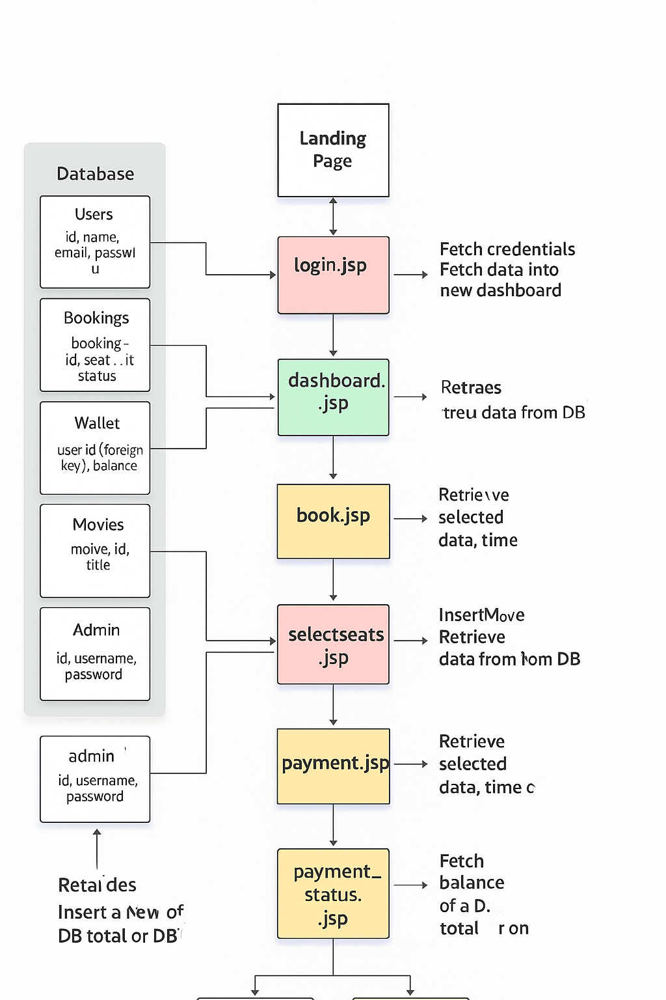

# 🎬 Online Movie Ticket Booking System

This is a Java-based web application project that enables users to register, log in, browse movies, book tickets, make payments, and view their booking history. Admins can manage movies and bookings through a separate dashboard.

---

## 🧩 Features

### 🔐 User Features
- User Registration and Login (Traditional & Google OAuth)
- Browse available movies
- Book seats by selecting showtime and seats
- View all previous bookings
- Wallet-based Payment System
- Ticket download in PDF format

### ⚙️ Admin Features
- Admin login
- Add new movies
- Delete existing movies
- View all user bookings

---

## 🧪 Technologies Used

| Layer      | Technologies                      |
|------------|-----------------------------------|
| Frontend   | HTML, CSS, JSP, Bootstrap         |
| Backend    | Java, Servlet                     |
| Database   | MySQL                             |
| Web Server | Apache Tomcat 9                   |
| Build Tool | Maven (optional)                  |
| IDE        | Eclipse / IntelliJ                |

---

## 📂 Database Schema

**Tables:**
- `users` — stores user data (`user_id`, `username`, `email`, `password`)
- `movies` — stores movie details (`movie_id`, `title`, `description`, `showtime`)
- `wallet` — stores user balance (`user_id`, `balance`)
- `bookings` — stores booking data (`booking_id`, `user_id`, `movie_id`, `seats`, `amount`, `status`)
- `admin` — stores admin login credentials

**Relationships:**
- `wallet.user_id` → `users.user_id` (FK)
- `bookings.user_id` → `users.user_id` (FK)
- `bookings.movie_id` → `movies.movie_id` (FK)

---

## 🔄 Application Flow

1. **Landing Page:** `index.jsp`
2. **Register/Login:** `register.jsp`, `login.jsp`
3. **User Dashboard:** `dashboard.jsp`
4. **Browse Movies:** `showMovies.jsp`
5. **Book Ticket:** `bookTicket.jsp`, `selectseats.jsp`, `booking.jsp`
6. **Store Booking:** `storeBooking.jsp`, `storeSession.jsp`
7. **Payment:** `payment.jsp` → `payment_status.jsp`
8. **Download Ticket:** `DownloadTicketServlet.java`
9. **View Bookings:** `showBookings.jsp`
10. **Admin Login:** `admin.jsp`
11. **Admin Dashboard:** `adminDashboard.jsp` → `insertMovie.jsp`, `deleteMovie.jsp`

---

## ▶️ How to Run the Project

1. **Clone the repository:**
    ```
    git clone https://github.com/yourusername/online-movie-ticket.git
    ```

2. **Import into IDE:**
    - Open Eclipse or IntelliJ
    - Import as Maven Project or Dynamic Web Project

3. **Set up MySQL Database:**
    - Create a database schema named `movie_booking`
    - Import SQL script to create necessary tables (if available)

4. **Configure Database Connection:**  
   Open `DBConnection.java` and update credentials:
    ```
    String url = "jdbc:mysql://localhost:3306/movie_booking";
    String username = "root";
    String password = "yourpassword";
    ```

5. **Deploy and Run:**
    - Deploy the project on **Apache Tomcat 9**
    - Start the server
    - Visit in browser:  
      [http://localhost:8080/ONLINE_MOVIE_TICKET/](http://localhost:8080/ONLINE_MOVIE_TICKET/)

---

## 📷 Architecture Diagram



## ✍️ Author

**Aryan Mehta**  
Frontend Developer | Java Backend Enthusiast | Hackathon Winner  
📧 aaryanmehta619@gmail.com


